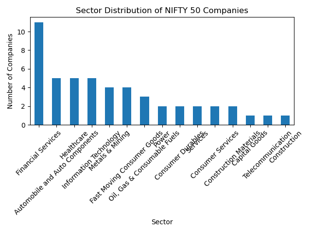

# 📊 NSE Market Analysis

Web scraping and exploratory data analysis of companies listed in the **NIFTY 50 index** using Python.


---

## 📌 Project Overview

This project demonstrates **web scraping, data cleaning, and exploratory data analysis (EDA)** using Python.

The goal is to collect and analyze data on companies listed in the **NIFTY 50 index**, one of the major stock market indices in India.

The project builds a small **data pipeline** that scrapes company information, processes the dataset, and performs analysis to understand **sector distribution among India's largest publicly listed firms**.

---

## 📊 Example Visualization

Sector distribution of companies in the NIFTY 50 index.



---

## 🎯 Project Objectives

* Scrape company and sector data from the NIFTY 50 index
* Clean and structure the data for analysis
* Perform exploratory data analysis (EDA)
* Visualize sector composition of the index
* Demonstrate reproducible data analysis using Python

---

## 🧠 Key Skills Demonstrated

* Web scraping with **BeautifulSoup**
* Data collection using **Requests**
* Data cleaning and analysis using **Pandas**
* Numerical computation with **NumPy**
* Data visualization using **Matplotlib**
* Exploratory Data Analysis (EDA)
* Reproducible analysis using **Jupyter Notebook**
* Version control with **Git and GitHub**

---

## 🛠 Technologies Used

* Python
* Pandas
* NumPy
* Matplotlib
* Requests
* BeautifulSoup
* Jupyter Notebook

---

## 📁 Project Structure

```text
nse-market-analysis
│
├── scraper.py                # Script to scrape NIFTY 50 company data
├── analysis.py               # Basic analysis and visualization script
├── requirements.txt          # Python dependencies
├── README.md
│
├── data/
│   └── nifty50.csv           # Scraped dataset
│
├── visuals/
│   ├── sector_distribution.png
│   └── sector_pie_chart.png
│
└── notebooks/
    └── nse_analysis.ipynb    # Exploratory data analysis notebook
```

---

## 📥 Data Collection

Data is collected by scraping publicly available information about **NIFTY 50 companies**.

The scraper extracts:

* Company name
* Sector classification

The collected data is stored in:

```
data/nifty50.csv
```

---

## 📊 Exploratory Data Analysis

The project includes analysis to understand the **sector composition of the NIFTY 50 index**.

Analysis includes:

* Sector frequency analysis
* Bar chart visualization of sector distribution
* Pie chart showing sector composition

Example insights:

* Financial Services and Information Technology companies represent a large share of the index.
* Sector concentration reflects the structure of India's large-cap equity market.

---

## ▶️ Running the Project

Clone the repository:

```
git clone https://github.com/Aliussman/nse-market-analysis.git
cd nse-market-analysis
```

Install dependencies:

```
pip install -r requirements.txt
```

Run the scraper:

```
python scraper.py
```

Run the analysis script:

```
python analysis.py
```

Launch the notebook for exploratory analysis:

```
jupyter notebook
```

---

## 🔮 Future Improvements

* Scrape additional financial metrics for each company
* Analyze stock price trends
* Perform statistical analysis on sector performance
* Expand analysis beyond the NIFTY 50 index

---

## 👨‍💻 Author

**Ali Usman**
Undergraduate Student – Plaksha University

This project was developed as part of my exploration of **data science, economics, and financial data analysis**.
